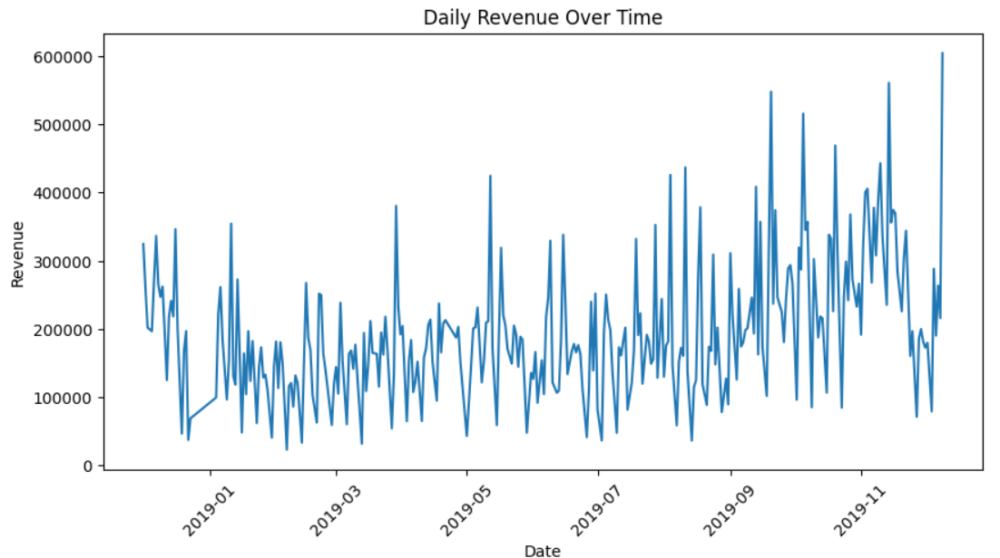
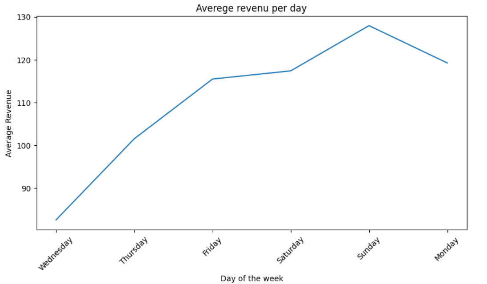
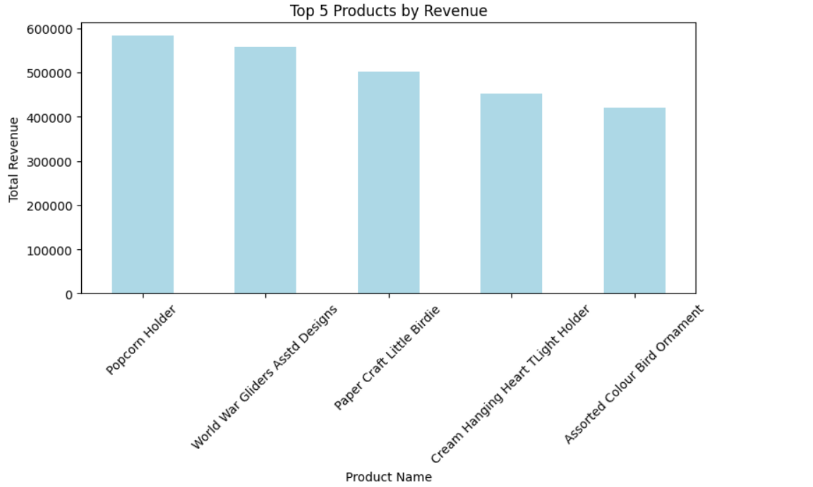
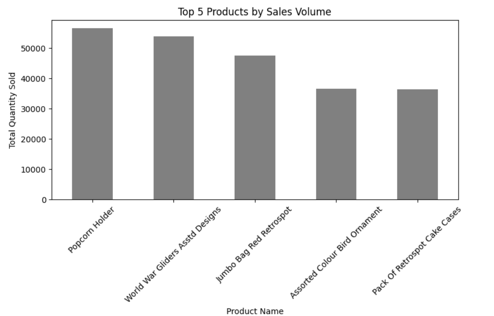
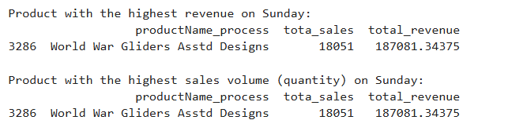
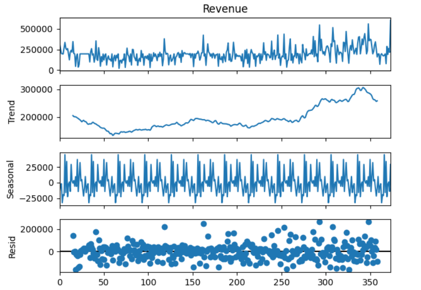

# Customer-Purchase-Analysis-and-Revenue-Forecasting [project Link](https://github.com/remmzytom/Customer-Purchase-Analysis-and-Revenue-Forecasting/blob/main/customer_analysis_and_revenue_forcasting.ipynb)

### Pre-requisite Skills: Python, Data Wrangling, Pandas, ARIMA, Data Visualization, Machine Learning Basics, Time Series Analysis

## Scenario
As a data analyst working for a retail company, my objective is to uncover insights from customer purchasing patterns and forecast future revenue. Using customer transaction data, my aim to identify frequent purchase behaviors, perform revenue time series analysis, and recommend products to customers based on their shopping history. This case will help decision-makers in retail optimize inventory, marketing strategies, and revenue generation.

## Introduction
Retail businesses generate a lot of transactional data, which needs efficient processing to uncover valuable insights and improve customer experience and revenue. In this project, Spark was used to handle the large dataset because of its ability to process data quickly and efficiently. Spark helped with tasks like filtering, grouping, and transforming data, making it ready for analysis.

The focus of this project is to understand customer buying habits, find frequently purchased items, and predict future revenue trends using data like transactions, product details, and revenue. By combining data analysis, machine learning, and prediction techniques, this project provides a clear way to improve retail operations and make better business decisions.

## skill set
- Data Preprocessing and Wrangling
- Spark (PySpark for large-scale data processing)
- Association Rule Mining
- Customer Behavioral Analysis
- Time Series Analysis
- Time Series Forecasting
- Feature Engineering
- Visualization
- Python Libraries and Tools (Pandas, NumPy, Matplotlib, Scipy, Statsmodels, Mlxtend, Scikit-learn)
- Algorithm Selection and Hyperparameter Tuning
- Domain Knowledge

### Plot the sum of revenue on transaction_date in a line plot and find out any immediate pattern / insight?

Over the year, the revenue appears to increase. And the increament spikes towards the ending of the year, around September and November are higher than those seen earlier in the year. This trend may indicate a growth in sales volume over time due to holidays and end of the year sale or the impact of cumulative marketing efforts.

Low-Revenue Periods:
There are notable periods where revenue dips to relatively low levels, suggesting times of reduced sales activity. These dips could be due to factors like reduced consumer spending, or  promotional activities, or some external factors affecting business operations.

  

 ## Determine which workday (day of the week), that generates the most sales.

 
 
Sunday Leads in Revenue: The graph clearly indicates that Sunday generates the most sales on average compared to other days of the week. This pattern suggests that Sunday might be a particularly busy day for the business, due to higher customers, weekend shopping

  

## Identify the name of product (column productName_process) that contributes the highest revenue on ‘that workday’  and the name of product that has the highest sales volume (sum of the Quantity), on ‘that workday’.

##  top 5 products that contribute the highest revenues in general and top 5 products that have the highest sales volumes in general.

#### In terms of revenue from the graph
the top 5 products that made the most money. "Popcorn Holder" brought in the highest revenue, followed by "World War Gliders Assorted Designs" and "Paper Craft Little Birdie". While all five products earned a lot, "Popcorn Holder" stands out as the biggest earner.

#### In terms of highest sales
the top 5 products that were sold in the highest quantities. are "Popcorn Holder" sold the most, followed closely by "World War Gliders Assorted Designs" and "Jumbo Bag Red Retrospot". The other two products, "Assorted Colour Bird Ornament" and "Pack Of Retrospot Cake Cases", also had high sales, but not as much as the top three.

### Which country generates the highest revenue? Additionally, identify the month in that country that has the highest revenue

Question 1.5
## . Determine the shopping frequency of customers to identify who shops most frequently  on customer level, . Also, find out what products  ‘this customer’ typically buys based on the Quantity of products purchased.

  

## exploring the revenue time series.

### Revenue Plot:

This plot is displaying the observed revenue data over time. This  pattern indicates fluctuations in revenue, with some noticeable spikes at different intervals, which shows that there are some high-revenue days in the monthly cycle.

### Trend plot:

The trend plot is displaying the trend component of the time series. with this output it shows the overall trend seems to be increasing slightly, with a gradual rise and then a decline towards the end period. This indicates the general direction of revenue over time.

### seasonal plot:

The is showing the seasonality of the revenue data. This is showing the repeated patterns at regular intervals, indicating that revenue tends to fluctuate in a predictable manner over time.

### Residual (Noise):

This plot represents the residuals or random noise after the trend and seasonal components have been removed. The residual points are scattered around zero, indicating random fluctuations. This indicates that after getting the trend and seasonality, there is still some unexplained variance in the revenue data.

  

## Conclusion
### Achievements of the Project
- Successfully analyzed a large retail dataset to understand customer behavior and revenue trends.
- Used Spark for fast and efficient data processing and analysis.
- Identified common product combinations with the Apriori algorithm, helping with bundling and cross-selling.
- Built an accurate ARIMA model to predict future revenue for better business planning.
- Created personalized product recommendations using customer similarity, improving customer satisfaction and increasing sales.
## Key Insights and Learnings
### Customer Purchase Patterns:
- Discovered popular product combinations and customer buying habits.

### Revenue Trends:
- Found seasonal patterns and peak sales periods, helping with inventory and marketing plans.

### Personalized Recommendations:
- Customer similarity analysis using a collaborative filtering approach provided tailored product recommendations, demonstrating the potential for improved customer engagement..

### Efficient Data Processing:
- Spark made handling and analyzing large datasets fast and easy.

### Advanced Analytics:
- Combined machine learning and statistical methods like Apriori and ARIMA to gain valuable insights.

    

## At a Broad Level
This project shows how data analytics can help businesses improve operations, sales, and customer satisfaction. Using tools like Spark for big data and ARIMA for forecasting gives valuable insights into inventory management, marketing strategies, and personalized recommendations. This project demonstrates how combining different analytics methods can solve real-world business problems effectively.

  

## references
[libraries](https://etda.libraries.psu.edu/catalog/23885rsr5259)

[libraries](https://etda.libraries.psu.edu/files/final_submissions/24573)

[2] Bosari, J. (2012, October 4). Real Costs of Choosing the Wrong Software Vendor. Forbes. https://www.forbes.com/sites/moneywisewomen/2012/10/04/real-costs-ofchoosing-the-wrong-software-vendor/?sh=4c29414b4997. [3] Schmidhuber, J. (2015). Deep learning in neural networks: An overview. Neural networks, 61, 85-117.

[4] [Ullah, M. I. (2020, August 23). Components of Time Series. Basic Statistics and Data Analysis.](https://itfeature.com/time-series-analysis-and-forecasting/components-of-timeseries.)

[5] Zhang, G. P. (2003). Time series forecasting using a hybrid ARIMA and neural network model. Neurocomputing, 50, 159-175.

[6] Rahman, M. M., Islam, M. M., Murase, K., & Yao, X. (2015). Layered ensemble architecture for time series forecasting. IEEE transactions on cybernetics, 46(1), 270-283.

[7] Sfetsos, A., & Coonick, A. H. (2000). Univariate and multivariate forecasting of hourly solar radiation with artificial intelligence techniques. Solar Energy, 68(2), 169-178.

[8] Chandra, R., & Zhang, M. (2012). Cooperative coevolution of Elman recurrent neural networks for chaotic time series prediction. Neurocomputing, 86, 116-123.

[9] Pan, C., Tan, J., Feng, D., & Li, Y. (2019, December). Very short-term solar generation forecasting based on LSTM with temporal attention mechanism. In 2019 IEEE 5th

International Conference on Computer and Communications (ICCC) (pp. 267-271). IEEE.
